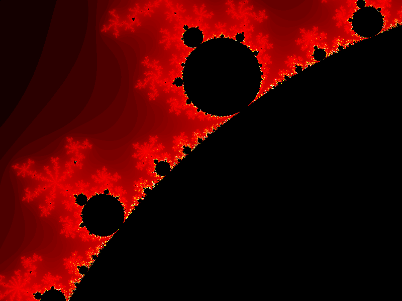
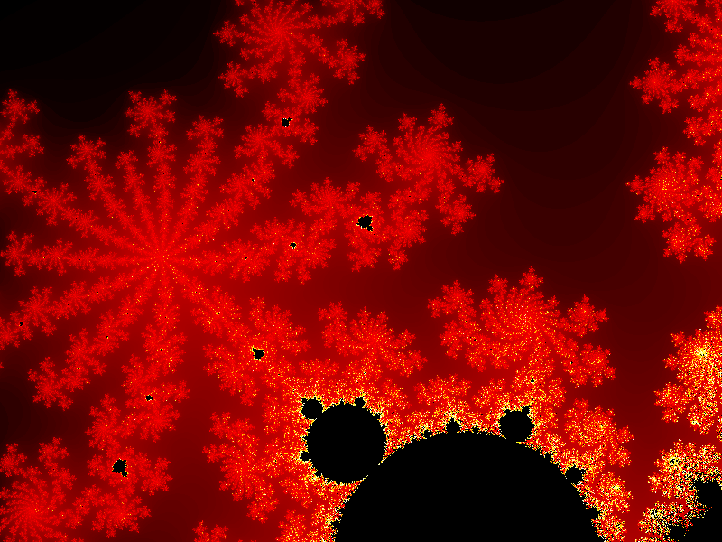

# C-Fractal-Images

Here is an example of fractal images using the mandelbrot algorithm, which also includes a Zoom in feature: 

# Before zoom in:

# After first zoom in: 

# After second zoom in:
 
